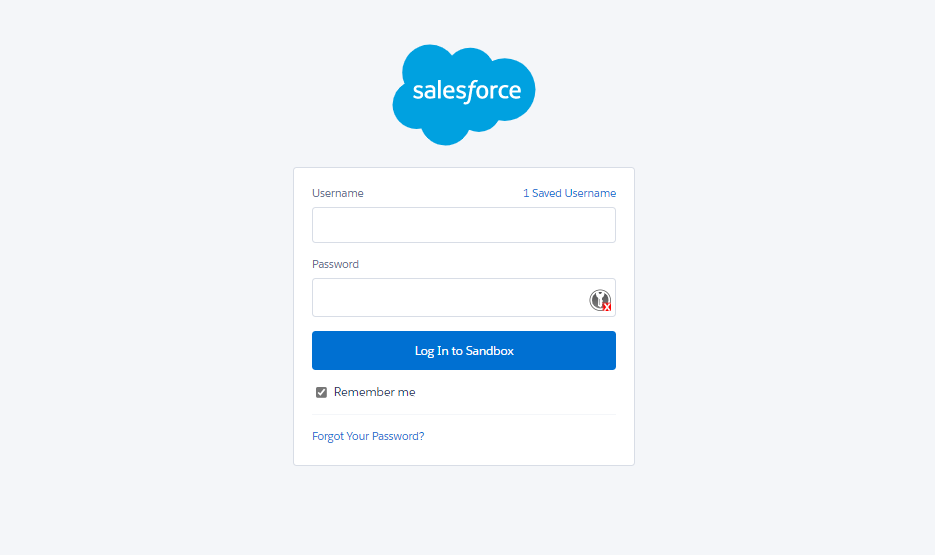
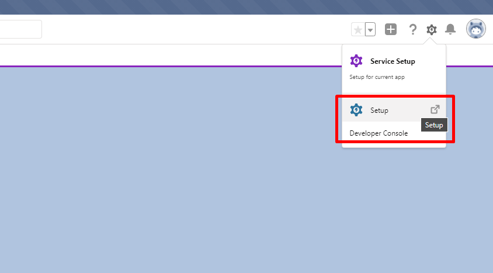
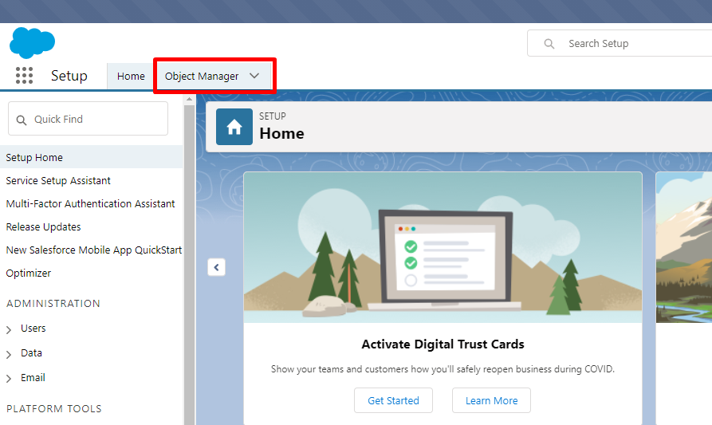
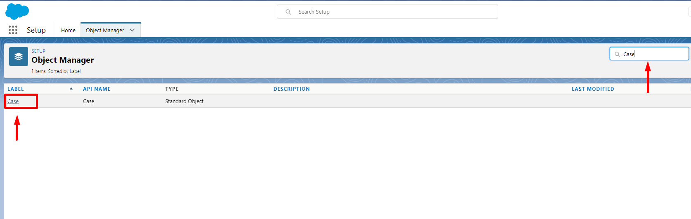
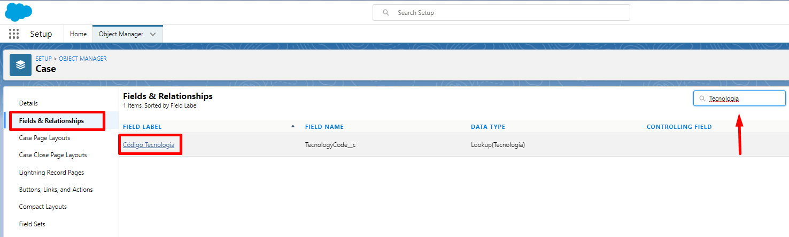
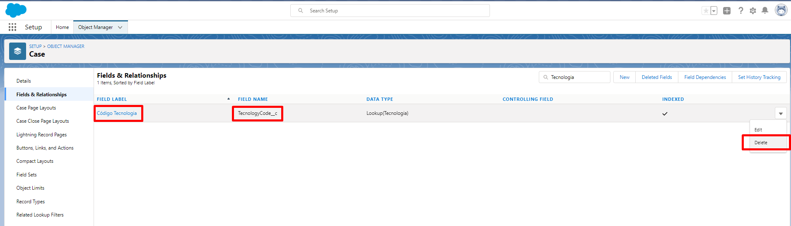
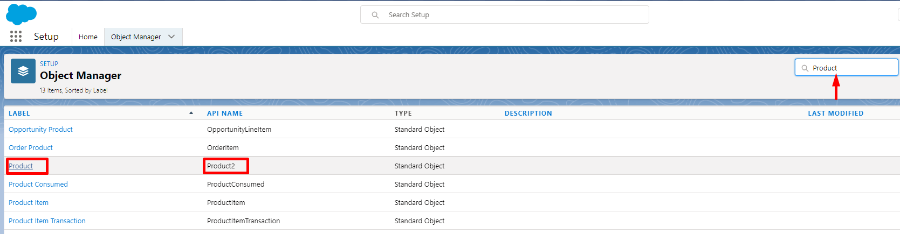
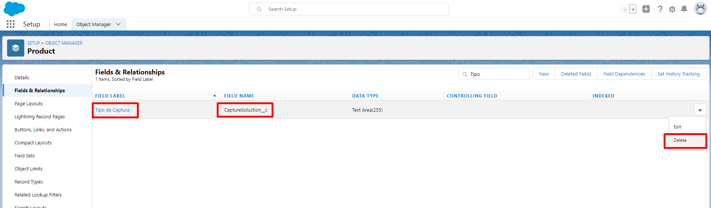
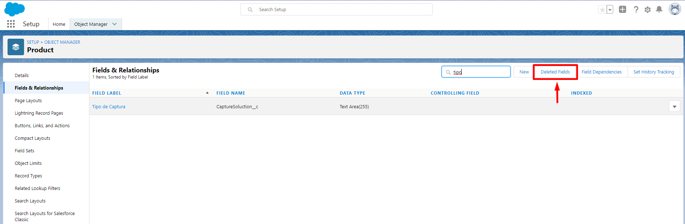
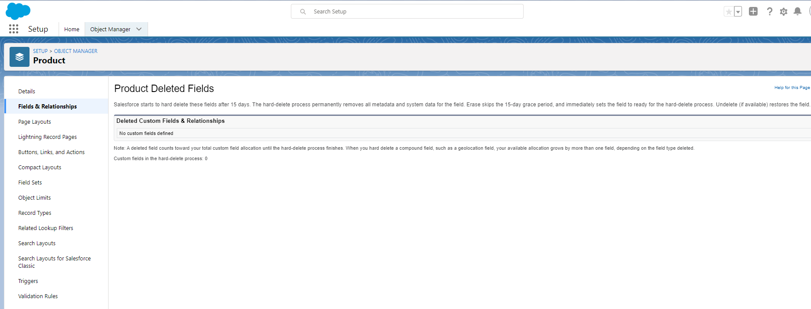

## Squad: Logistica e Atendimento
#### **Remover sObject `TecnologyCode__c`**
------------
**US Vinculada:** FASE1

**Aplicar nos ambientes:** N/A

**Ambientes já configurados:** CINT, TIACC, UAT, STG e PRD

1. Login no ambiente
  

  
2. Clicar em Setup > Gerenciador de objetos > **Case**
  

  

  

  
3. Selecionar Campos e relacionamentos > **Codigo de Tecnologia**
  

  
4. Remover Codigo e Tecnologia : `TecnologyCode__c`
  

------------
 

## Squad: Logistica e Atendimento
#### **Remover sObject `CaptureSoluction__c`**
------------
**US Vinculada:** FASE1

**Aplicar nos ambientes:** N/A

**Ambientes já configurados:** CINT, TIACC, UAT, STG e PRD

1. Login no ambiente
  

  
2. Clicar em Setup > Gerenciador de objetos > **product2 (Produto)**
  

  
3. Remover Tipo de Captura : `CaptureSoluction__c`
  

  
4. Clicar em **campos excluidos** e em **apagar o campo**
  

  
5. Repetir os passos acima para ***"Feira e Eventos"* e *"Case"***
  

------------
